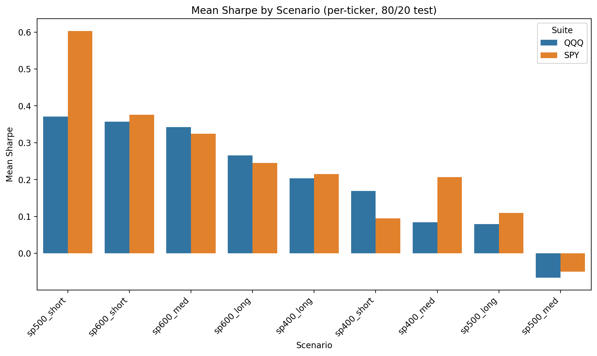
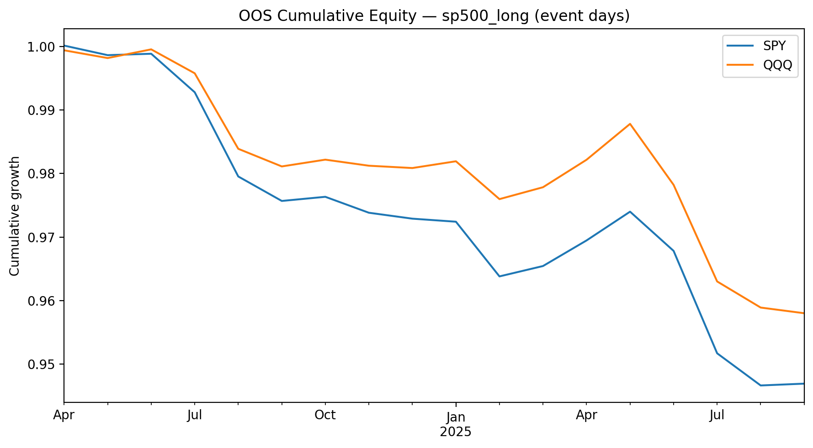
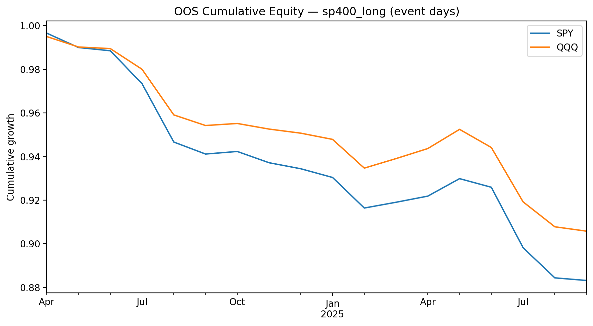
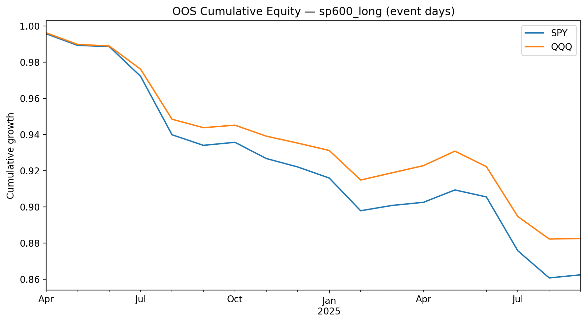
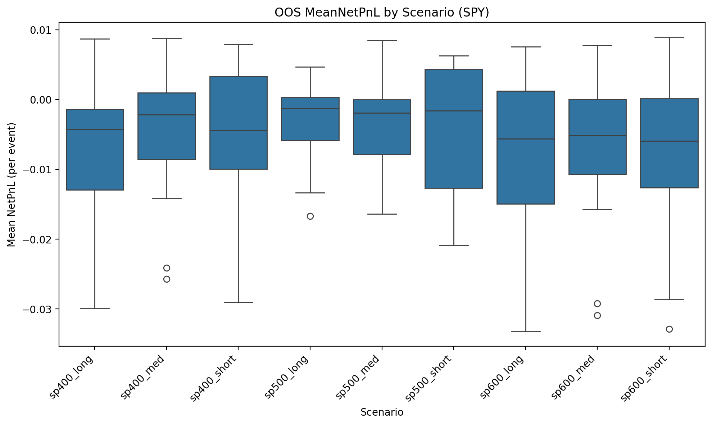

# Hedged Next-Day Direction for S&P 1500 Stocks

**Author:** Jon Kjartansson
**Course:** UC Berkeley - ML & AI
**Assignment:** Capstone Project — Final Report

## Summary (nontechnical)

**Goal:** Predict **tomorrow's direction** for individual stocks and **hedge** each trade to isolate idiosyncratic alpha.

**Hedges tried:** Market (SPY or QQQ), Sector (SPDR sector ETFs), and **Size** (MDY for mid, IJR for small when applicable).

**Why:** If we can forecast a small edge on the next day and neutralize broad market/sector moves, a diversified book could compound.

**Key results:**
- In classic 80/20 time-split tests, **short-history universes** (especially S&P 500 "short") had the **highest average per-ticker Sharpe**; **S&P 500 "med"** lagged.
- In true out-of-sample **one-day event** tests for 2024-2025, **portfolio equity trended down** for long-history universes; however, **pockets of strong names exist** (mostly SMID), and **QQQ** was typically the more robust hedge.
- **Recommendation:** Deploy a **pilot**, focused on **SMID** scenarios and a **selected set of tickers** with positive OOS mean net PnL; use **QQQ** as the default hedge for SMID.

---

## Business problem

Make day-ahead, hedged trades on single stocks to capture idiosyncratic moves while minimizing exposure to broad market, sector, and (when applicable) size factors.

**Prediction target:** sign of next-day return; trade only when the model's probability crosses a threshold (with an optional "dead band" to avoid low-conviction signals).

---

## Data

- **Prices:** S&P 1500 constituents (can be user-provided lists of US stock tickers), downloaded via `yfinance`
- **Hedge proxies (ETFs):**
  - Market: `SPY`, `QQQ`
  - Sectors: `XLK, XLY, XLP, XLE, XLF, XLV, XLI, XLB, XLU, XLRE, XLC`
  - Size (conditional): `MDY` (mid), `IJR` (small)
- **Macro proxies (where used):** `^VIX`, `TLT`, `IEF`, `LQD`, `HYG`, `UUP`
- **Date windows:**
  - **Long:** start approx 2000-01-01
  - **Medium:** start approx 2005-01-01
  - **Short:** start approx 2016-01-01
  (Per-ticker dynamic starts are used to ensure enough warmup (history of data) for features/betas.)

All data are daily close; returns are computed as simple percent change.

---

## Scenarios (universes)

The stock universe was grouped into nine buckets by index (market cap) and length of price history:
`sp500_long`, `sp500_med`, `sp500_short`, `sp400_long`, `sp400_med`, `sp400_short`, `sp600_long`, `sp600_med`, `sp600_short`.

Each scenario is analyzed under two hedge suites (market-hedge variants):
- **SPY suite** (market hedge = SPY)
- **QQQ suite** (market hedge = QQQ)

---

## Features and labels (per stock, daily)

- **Features (examples):** prior return(s), MA10/MA30, RSI, rolling vol, and contextual ETF returns (market/sector/size).
- **Label:** `y = 1` if next day's return is positive, else `0`.
- All windows are rolling; no look-ahead.

---

## Models and hyper-parameters

- **Logistic Regression (LR)** - linear baseline.
- **Random Forest (RF)** - non-linear benchmark with a compact grid.
- **Threshold and Band:** Convert probability to trades on both sides:
  - **Long** if `p_up >= T` and `(p_up - 0.5) >= band`
  - **Short** if `p_up <= (1 - T)` and `(0.5 - p_up) >= band`
  - **Otherwise** no trade

---

## Hedging and beta sizing

Rolling betas (beta) are estimated for each stock to market, sector, and (mid/small) size factors when applicable (window ~60 days, min ~20):

HedgedReturn ≈ StockReturn
- beta_market * MarketReturn
- beta_sector * SectorReturn
- beta_size * SizeReturn (size term only for mid/small)

$$
\text{HedgedReturn} \approx \text{StockReturn}
- \beta_{\text{mkt}}\cdot \text{MarketReturn}
- \beta_{\text{sec}}\cdot \text{SectorReturn}
- \beta_{\text{size}}\cdot \text{SizeReturn}
$$

$$
\begin{aligned}
\text{HedgedReturn}_t \;\approx\; &\ \text{StockReturn}_t \\
&- \beta_{\text{mkt},t}\,\text{MarketReturn}_t \\
&- \beta_{\text{sec},t}\,\text{SectorReturn}_t \\
&- \beta_{\text{size},t}\,\text{SizeReturn}_t
\end{aligned}
$$

This removes systematic risk so results reflect stock-specific alpha.

---

## Method

1) **80/20 time split (no shuffle)**
- Train on first 80% of time, test on last 20%.
- Report per-ticker metrics and scenario distributions (Sharpe, etc).

2) **One-Day Holdout (event days)**
- For a set of calendar month-end signal dates, train using all history up to that date, then predict only the next trading day.
- Aggregate event-day PnL across tickers to create OOS equity curves and Mean NetPnL distributions by scenario.
- One-Day window: Month-ends from 2024-04-30 through 2025-09-30

---

## Glossary: Key concepts and acronyms

- **SPY** - SPDR S&P 500 ETF; broad U.S. large-cap market proxy.
- **QQQ** - Invesco Nasdaq-100 ETF; growth/tech-tilted market proxy.
- **S&P 500 / 400 / 600** - U.S. large / mid / small-cap indices.
- **SMID** - Small and Mid-cap stocks collectively.
- **Sector ETFs** - SPDR funds used as sector hedges: XLK, XLY, XLP, XLE, XLF, XLV, XLI, XLB, XLU, XLRE, XLC.
- **Size proxies** - MDY (mid-cap) and IJR (small-cap) used to hedge size factor exposure.
- **Hedge** - Offset position to neutralize systematic risk (market/sector/size) to isolate idiosyncratic alpha.
- **Beta (beta)** - Sensitivity of a stock's return to a factor. The hedge is sized with beta.
- **CAGR** - Compound Annual Growth Rate (strategy equity).
- **Sharpe** - Risk-adjusted return: mean daily excess return / daily volatility, annualized.
- **MaxDD** - Maximum Drawdown: largest peak-to-trough equity decline.
- **AUC / PR-AUC** - Classifier discrimination metrics (1.0 = perfect, 0.5 = random).
- **RSI** - Relative Strength Index (momentum oscillator).
- **MA** - Moving Average (for example MA10, MA30).
- **IS / OOS** - In-sample vs Out-of-sample.
- **One-day holdout** - Train up to a date, predict the next day only.
- **Threshold / Band** - Probability cutoff and a no-trade buffer near 0.5.
- **Trade rate** - Fraction of days with a trade after threshold/band.
- **NetPnL** - Hedged per-trade profit (fees/slippage not included).

Rule of thumb: an OOS Mean NetPnL of 0.003 is approximately +0.30% average on signal days (pre-frictions).

## Results

### 1) Classic 80/20 experiments (per-ticker)



- Short-history universes lead; SP500_med underperforms.
- Across SMID, QQQ often matches or slightly edges SPY as the hedge.

See KDEs under `results/_summaries/figs/` for full distributions, e.g.:
`is_sharpe_kde_sp600_long.png`, `is_sharpe_kde_sp400_med.png`, etc.

### 2) Out-of-sample one-day (2024-2025 window)

  
  


- For long scenarios, cumulative equity drifted down in this period.
- QQQ hedge generally lost less than SPY, suggesting better alignment with the traded names.

Per-ticker payoff dispersion (SPY shown; QQQ similar):


- Medians around 0 or negative imply broad, unfiltered deployment would dilute edge.
- However, there are meaningful positive outliers. Selection is key.

### 3) OOS top performers (QQQ hedge)

  
  
  
  


Examples: FTRE, HCC (SP600_short); GKOS, ADMA (SP600_med); VCEL (SP600_long); ANF, SSD (SP400_long); MRNA, COIN (SP500_short).

---

## Decisions and recommendations

**Hedge choice**
- Default: **QQQ** for SMID universes; **SPY** as benchmark.

**Scenario gating**
- **Pass / Deploy (pilot, watchlist-based):**
  - SP600_short, SP600_med, SP500_short
- **Soft / Monitor (ticker-selected only):**
  - SP400_long, SP600_long
- **Fail (for now):**
  - SP500_long, SP500_med

**Operational rule of thumb**
- Only trade tickers with positive OOS mean net PnL, enough event count, and acceptable liquidity/spread.
- Equal-weight across selected names; reassess monthly.

---

## Next steps

- Add **regime filters** (trend/VIX) to enable or disable signals.
- Add **seasonality** and close-to-open or overnight features.
- Mild **feature sensitivity analysis** and threshold/band tuning.
- Potential: **walk-forward** with periodic retraining for the last 12-24 months.

---

## How to reproduce

### Environment

```bash
python --version
pip install pandas numpy scikit-learn yfinance matplotlib seaborn


### Run the notebooks (order)

1) `01_EDA.ipynb`
   - optional: EDA was previously submitted as part of module 20
2) `02_Model_80_20_and_OneDay_OOS.ipynb`
   - 80/20 per-scenario runs -> writes `results/_summaries/...` and IS figures
   - One-Day Holdout monthly event runs -> writes `results/<scenario>_ONE_DAY_*` and OOS rollups
3) `03_Finalize_and_Report.ipynb`
   - Finalize and Report -> aggregates to `results/_finalized/...` (decision pack, selection index, top tickers charts)

### Where results land

- `results/_summaries/` - IS distributions + OOS summaries and figures
- `results/_finalized/` - final decision tables and top tickers plots
- Scenario-specific OOS folders: `results/<scenario>_ONE_DAY_*`

---

## Repository layout (this submission)
```markdown
```text
.
├─ 01_EDA.ipynb
├─ 02_Model_80_20_and_OneDay_OOS.ipynb
├─ 03_Finalize_and_Report.ipynb
├─ results/
│  ├─ _summaries/
│  │  ├─ exp_all_metrics.csv
│  │  ├─ B1_... B6_....csv
│  │  └─ figs/*.png
│  ├─ _finalized/
│  │  ├─ FINAL_decision_pack_ALL.csv
│  │  ├─ FINAL_selection_index.csv
│  │  └─ top_tickers_bar_*.png
│  └─ _one_day/
│     └─ <scenario>_ONE_DAY_*/   # per-date event outputs
├─ eda/
├─ data/
└─ README.md

### Configuration notes (used in notebooks)

- `BETA_WINDOW = 60`, `BETA_MINPER = 20` — rolling window / minimum observations for betas  
- `TEST_SIZE = 0.20` — final 20% of time for 80/20 split  
- `VAL_FRAC = 0.20` — fraction of train used for quick threshold/band tuning

---

### Rubric mapping

**Project Organization**
- README with clear summary and pointers to notebooks and outputs  
- Combined modeling notebook with labeled sections; only necessary files tracked  
- Results organized in `results/_summaries` and `results/_finalized`

**Syntax and Code Quality**
- Clean imports, comments, sensible variable names, no fatal errors  
- Pandas + Matplotlib/Seaborn used idiomatically; concise tables and figures

**Visualizations**
- Scenario-level KDEs and bar charts with titles and readable axes/labels  
- OOS equity curves on event days; boxplots of Mean NetPnL by scenario

**Modeling**
- Multiple classifiers (LR, RF); clear metrics (Sharpe, MaxDD, AUC/PR-AUC)  
- Time-ordered train/test (80/20) and One-Day Holdout procedure  
- Rationale for thresholds, hedging choice (SPY vs QQQ), and metrics documented

**Findings**
- Business framing, limitations, and actionable next steps documented  
- Final decisions provided (`FINAL_decision_pack_ALL.csv`, selection and top-tickers plots)

---

### License and disclaimer

This project is intended for educational purposes only and is not investment advice. Past performance does not guarantee future results.

---

### Footnotes

Generative AI assisted with drafting or refactoring some utility functions, formatting this README, and refining wording for clarity.

